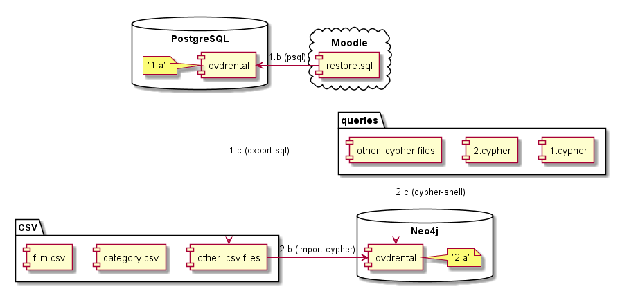

# IU-DMD-NoSQL
An assignment on Data Modelling and Databases II Spring 2020 (2nd year) course in Innopolis University

## General information

* Everything is tested only with `psql (PostgreSQL) 12.2`, `Neo4j Desktop 1.2.4`, `Neo4j Server 4.0.0 Enterprise` and `Cypher-Shell 4.0.1`
* [Description of the task](https://hackmd.io/@T2MYP-UFRZG1_qAeeMwS1Q/BJJFc7tmI)
* [ERD of the database](task.pdf)
* [Dump of psql database](task.zip)
* [The pdf report](report.pdf) (has the same information as this readme)

## Moving the database

1. Working with postgresql
    - 1.a. Create postgre database `dvdrental`
    - 1.b. Importing SQL dump from moodle to database (change paths inside the file first) 
`psql -U postgres -h localhost -p 5432 -d dvdrental -f ".../restore.sql"`
    - 1.c. Export to CSV files using `export.sql` (change paths inside the file first) 
`psql -U postgres -h localhost -p 5432 -d dvdrental -f ".../export.sql"`

2. Working with neo4j
    - 2.a. Create a neo4j database `dvdrental` with password `password` 
In config file, change `dbms.directories.import` to the directory containing exported CSV files
OR copy exported CSV files to default import folder (`<NEO4J_HOME>/import/`)
    - 2.b. Import to Neo4j using `import.cypher` 
`cypher-shell -u neo4j -p password -f ".../import.cypher"`
    - 2.c. Execute queries 
`cypher-shell -u neo4j -p password -f ".../queries/n.cypher"`

## Adjustments that were necessary for the new database

1. Neo4j has no “enum” type, so I had to leave the `film.rating` field as a text.
2. Neo4j can not store the binary data, so `staff.picture` field may be converted to unique id for each
picture and pictures itself can be stored in file system.
3. For fulltext search in Neo4j, corresponding index can be used, so field `film.fulltext` is not needed
4. Pure Neo4j does not support triggers, so `last_update` field would have to be handled in insert queries
5. Foriegn keys are represented as relations in Neo4j, so corresponding indexes are not needed
